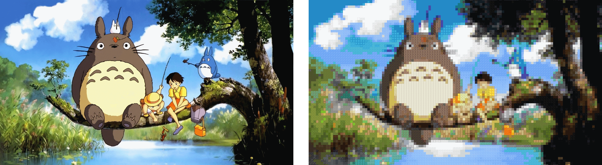
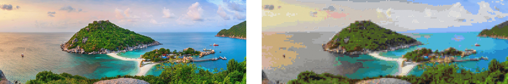
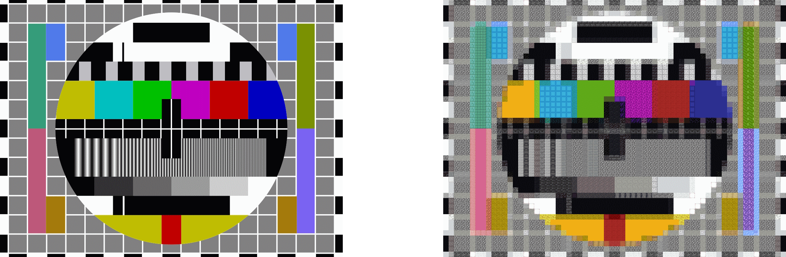
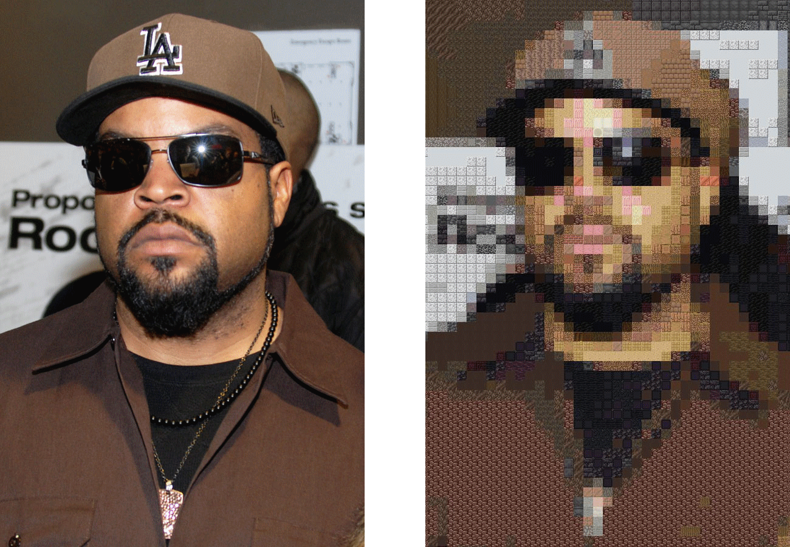

# MinecraftImageFilter

A fun way to stylise images.

(mainly a simple project to teach myself how to use Git)

## Description
What if you could turn images into wicked-cool minecraft-like tapestries? Look no further.

## Examples

Here are some examples of what the program can do with images of different resolutions.
(zoom in!)

### Examples










## Requirements
- Java 21 or higher

- Maven 3.8 or higher

## Installation

extract zip file and install with 
```CLI
mvn clean install
```

## Usage
Use the application to add images to the input folder, transform said images and view them in the output folder
(Supported filetypes: JPEG, PNG, BMP, WBMP, GIF*)

This program works on resolutions from 1x1 up to ~15000x15000 (the latter uses a lot of resources) 

*GIF isn't properly supported yet, only a static image (first frame of GIF) is transformed. Support for the GIF format is planned in the future. Maybe.


## Authors and acknowledgment
The creators of the minecraft textures. Thanks guys.

## License

N/A

## Project status

Under development.